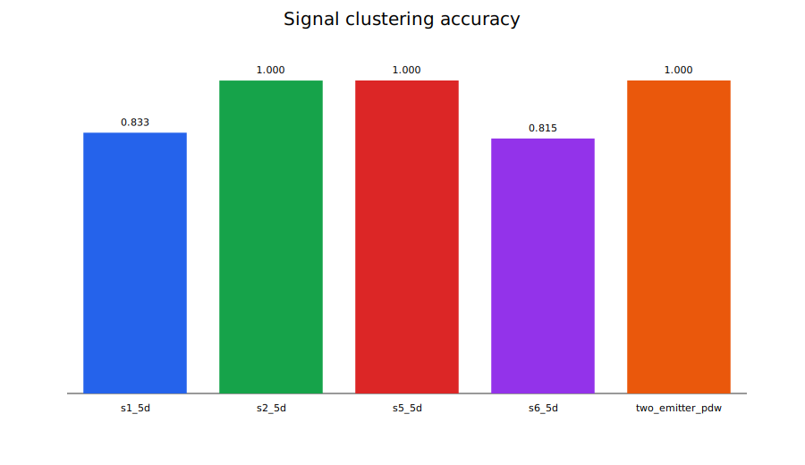
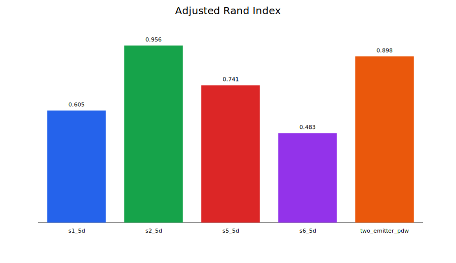
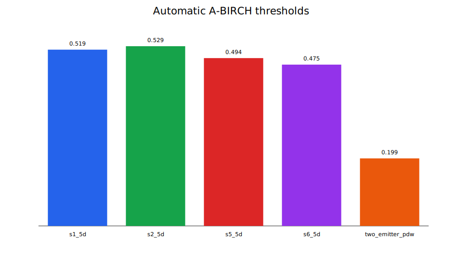

# A-BIRCH analysis report

Every dataset was fitted independently using A-BIRCH. Ground truth was used only after clustering for validation.

| Dataset | Rows | Threshold | Leaf CFs | Gap estimate | Final detected clusters | BIRCH noise | Signal accuracy | Overall accuracy | ARI | Paper conditions |
|---|---:|---:|---:|---:|---:|---:|---:|---:|---:|---|
| s1_5d | 32000 | 0.518911 | 2 | 3 | **2** | 0 | 0.8332 | 0.7351 | 0.6050 | separation: WARNING; weight: WARNING |
| s2_5d | 32343 | 0.529058 | 6 | 3 | **3** | 2613 | 0.9998 | 0.9567 | 0.9562 | separation: WARNING; weight: WARNING |
| s5_5d | 32000 | 0.494041 | 2 | 4 | **2** | 0 | 1.0000 | 0.8567 | 0.7414 | separation: WARNING; weight: WARNING |
| s6_5d | 32000 | 0.474854 | 2 | 4 | **2** | 0 | 0.8146 | 0.6523 | 0.4828 | separation: WARNING; weight: WARNING |
| two_emitter_pdw | 1900 | 0.198835 | 2 | 2 | **2** | 0 | 1.0000 | 0.9474 | 0.8978 | separation: WARNING; weight: WARNING |

## Graphs

## Interpretation

- `s2_5d`, `s5_5d`, and the two-emitter dataset separate their signal emitters very accurately.
- `s1_5d` and `s6_5d` are under-clustered by pure tree-BIRCH: distinct labeled emitters merge geometrically.
- Noise detection is strongest for `s2_5d`; in the other datasets, the automatic radius absorbs noise into signal CFs.
- All paper-condition warnings are retained because the radar data is five-dimensional and not guaranteed to be isotropic Gaussian data.

Each dataset folder contains `birch_results.csv`, `birch_validation_report.txt`, `confusion_matrix.csv`, `confusion_matrix.svg`, and `cluster_sizes.svg`.
